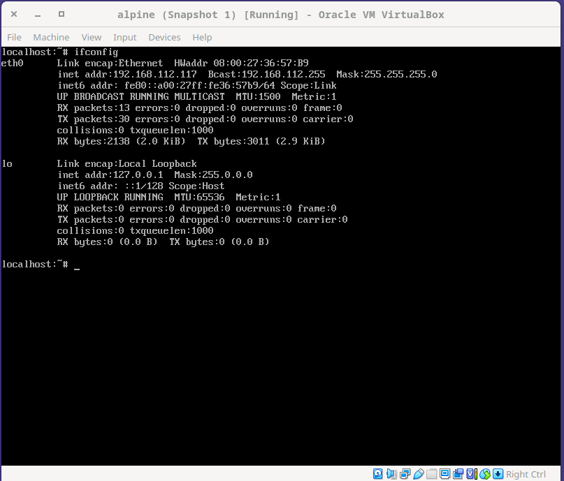
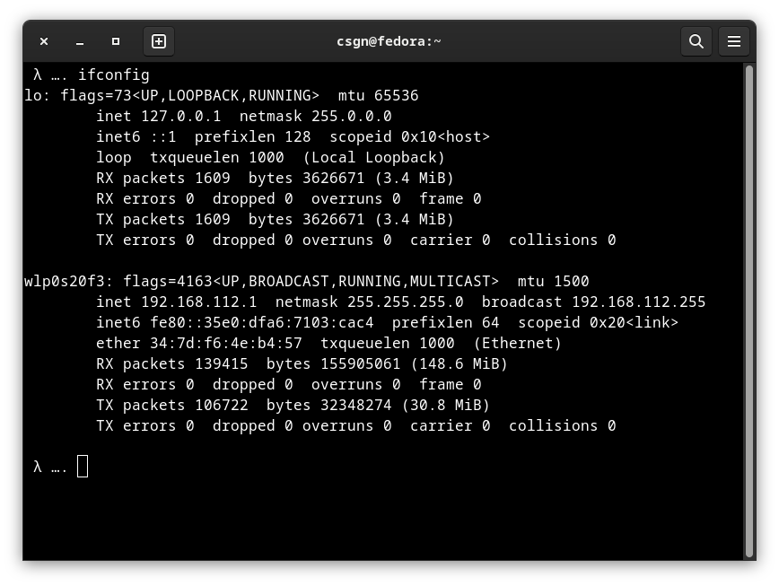
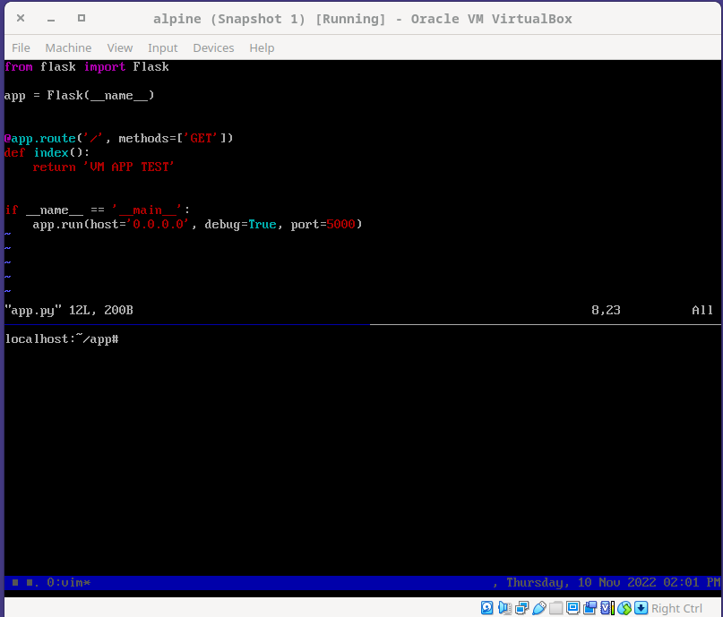
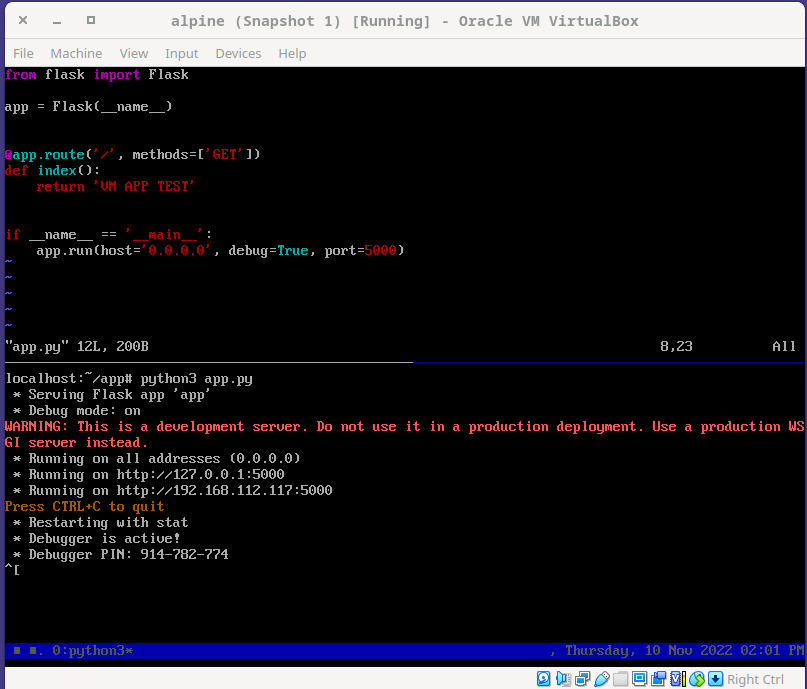
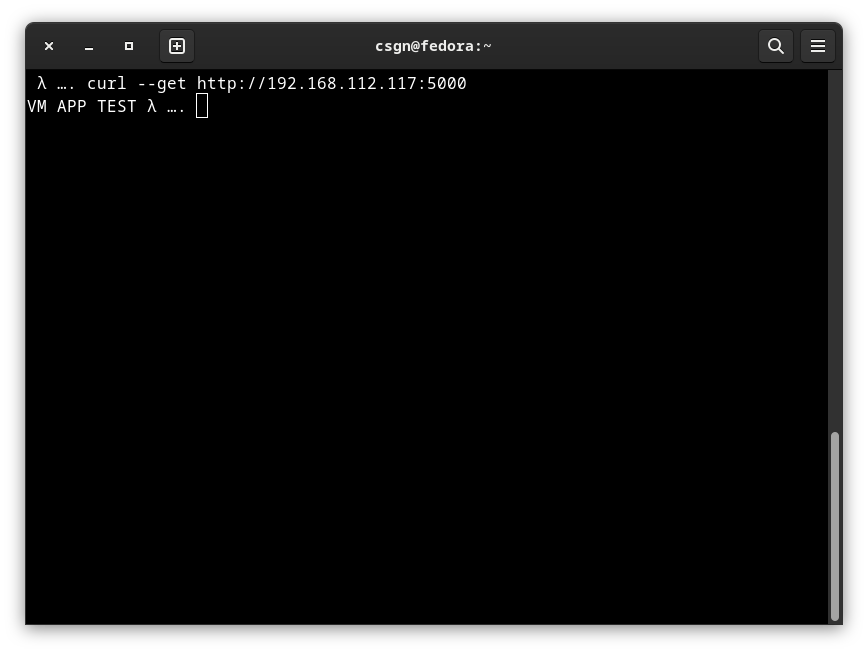
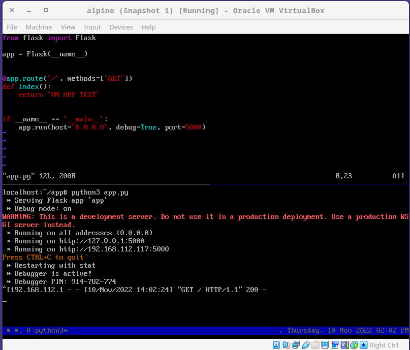

# VM

`i used the VirtualBox in this case, 'cuz it's free :)`

`we have a virtual machine that running on the vbox.`

`my host and the VM that running on the vbox are on the same network so we can do to request from the host to the VM and vice-versa`

#### VM


#### HOST


`let's make a simple flask app and run on the vbox.`
#### VM


```py
from flask import Flask

app = Flask(__name__)

@app.route('/', methods=['GET'])
def index():
  return 'VM APP TEST'
  
if __name__ == '__main__':
  # the host cannot be connect to the vm if the host and port are not specified.
  app.run(host='0.0.0.0', debug=True, port=5000)
```

`let's run the Flask app and make a request from the host`


`and that's it. the vm responds to host's request`

#### HOST


#### VM



